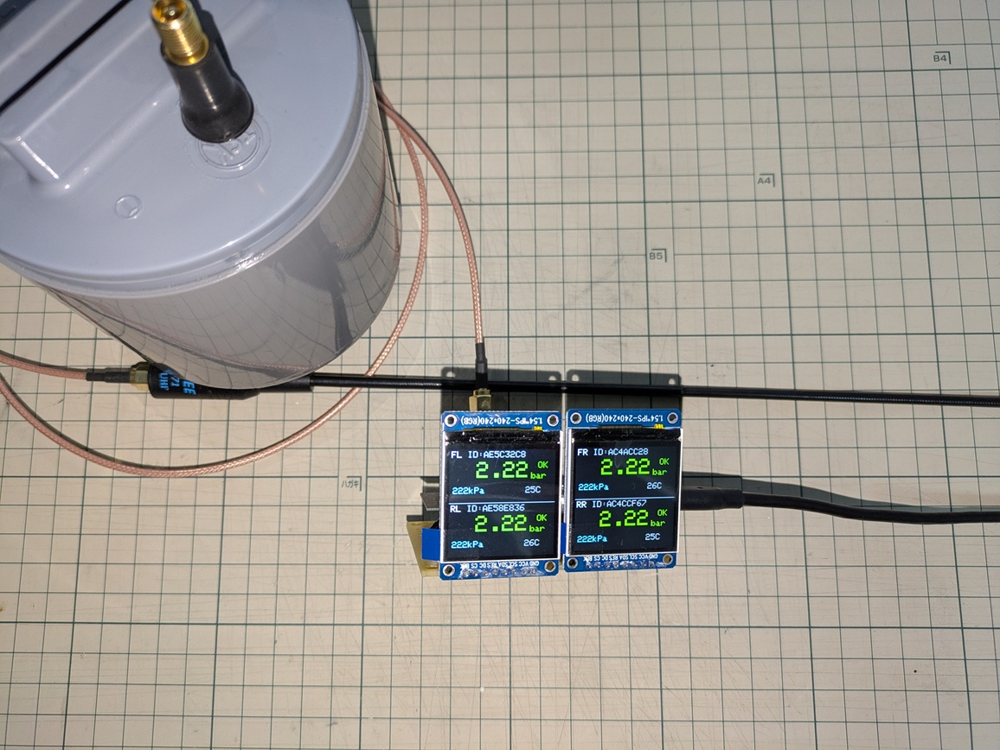

# TPMS受信機（Nissan / Continental）

ESP32-S3 + CC1101 を使ったタイヤ空気圧モニタ（TPMS）センサー受信機プロジェクト。

- **315.0 MHz** / 8.192 kbps / FSK Manchester符号化（G.E. Thomas）
- CRC-8（poly=0x07, init=0xAA）による検証済みデコード
- 4輪の空気圧（bar/kPa）・温度をデュアルLCDに表示



## 対象センサー

| 項目 | 内容 |
|------|------|
| メーカー | Continental |
| 型番 | S180052353E |
| FCC ID | KR5S180052015B |
| 日産部品番号 | 40700-4GA0B |
| 周波数 | 315.0 MHz |

### センサーID一覧

| 位置 | センサーID |
|------|-----------|
| FL | AE5C32C8 |
| FR | AC4ACC28 |
| RL | AE58E836 |
| RR | AC4CCF67 |

## パケット構造（64ビット = 8バイト）

```
Brand(8) + SensorID(32) + Pressure(8) + Temperature(8) + CRC-8(8)
```

- **Pressure**: PSI = raw / 4, kPa = PSI × 6.895, bar = kPa / 100
- **Temperature**: ℃ = raw − 52
- **CRC-8**: poly=0x07, init=0xAA（バイト0〜6に対して計算）

## ハードウェア

| 部品 | 内容 |
|------|------|
| マイコン | ESP32-S3-WROOM-2 N32R16V (DevKitC-1) |
| 受信IC | CC1101（315MHz帯） |
| LCD | 秋月電子 M154-240240-RGB（ST7789, 240×240）× 2台 |
| アンテナ | 38cm ホイップ + 1m SMAケーブル |
| フレームワーク | PlatformIO / Arduino |

## ドキュメント

- [ハードウェア構成・ピン配線](doc/index.md)
