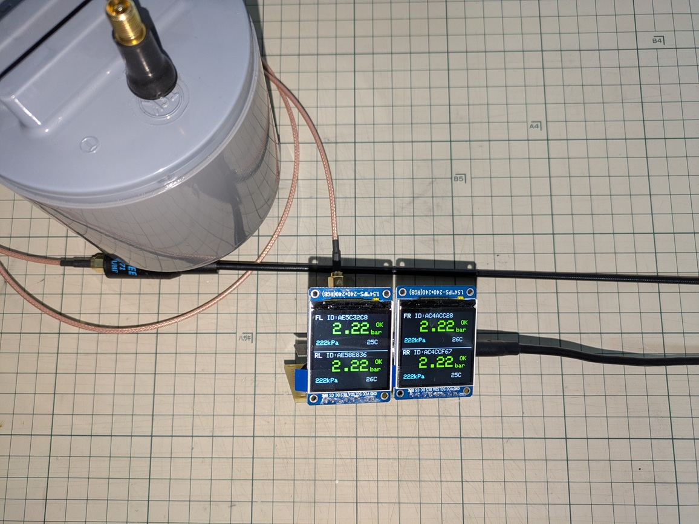

# TPMS受信機（Nissan / Continental）

ESP32-S3 + CC1101 を使ったタイヤ空気圧モニタ（TPMS）センサー受信機プロジェクト。

- **315.0 MHz** / FSK + Manchester符号化（G.E. Thomas）
- 停止時（PARK）・走行時（DRIVE）の2モードに対応

| モード | 半ビット長 | チップレート | ビットレート |
|--------|-----------|-------------|-------------|
| PARK（停止中） | 122µs | 8192 chip/s | 4096 bps |
| DRIVE（走行中） | 約52µs（実測） | 約19.2k chip/s | 約9.6 kbps |

※ チップレート = 1 ÷ 半ビット長、ビットレート = チップレート ÷ 2（Manchester）
- CRC-8（poly=0x07, init=0xAA）による検証済みデコード
- 4輪の空気圧（bar/kPa）・温度をデュアルLCDに表示



## 対象センサー

| 項目 | 内容 |
|------|------|
| メーカー | Continental |
| 型番 | S180052353E |
| FCC ID | KR5S180052015B |
| 日産部品番号 | 40700-4GA0B |
| 周波数 | 315.0 MHz |

### センサーID一覧

実装では Autel MX-Sensor で書き込んだ ID（コード側で登録）を使用しています。
開発ID は当初の純正センサー捕捉時のもので、参考として併記します。

| 位置 | センサーID（実装 / Autel MX-Sensor） | 開発ID（純正・参考） |
|------|--------------------------------------|----------------------|
| FL | 11111111 | AE5C32C8 |
| FR | 22222222 | AC4ACC28 |
| RL | 33333333 | AE58E836 |
| RR | 44444444 | AC4CCF67 |

## パケット構造

### 停止モード (PARK) - 4096 bps

```
Brand(8) + SensorID(32) + Pressure(8) + Temperature(8) + CRC-8(8) + [Extra(8)]
```

- **フレーム長**: 8 バイト（＋任意の追加1バイト）、CRC は byte 0～6 に対して計算
- **Brand**: 0xA8（通常）/ 0x98（圧力変動時）/ 0x80（LFトリガー時）
- **Pressure**: PSI = raw / 4, kPa = PSI × 6.895, bar = kPa / 100
- **Temperature**: ℃ = raw − 52
- **Extra**: CRC の後ろに付く場合がある（BAT?フラグ＋シーケンスカウンタ、CRC対象外）

### 走行モード (DRIVE) - 約9.6 kbps

```
Brand(8=0xB9) + SensorID(32) + Pressure(8) + Temperature(8) + Flags(8) + CRC-8(8)
```

- **フレーム長**: 9 バイト、CRC は byte 0～7 に対して計算
- **Brand**: 0xB9（実測）
- **Flags**: 01～04（1回の送信で同じデータが4回送信される）
- **Pressure / Temperature**: PARK と同じ計算式

### CRC-8

- **多項式**: 0x07
- **初期値**: 0xAA
- PARK: byte 0～6、DRIVE: byte 0～7 に対して計算

## ハードウェア

| 部品 | 内容 |
|------|------|
| マイコン | ESP32-S3-WROOM-2 N32R16V (DevKitC-1) |
| 受信IC | CC1101（315MHz帯） |
| LCD | 秋月電子 M154-240240-RGB（ST7789, 240×240）× 2台 |
| アンテナ | 1/2λ(半波長)ダイポールアンテナ |
| フレームワーク | PlatformIO / Arduino |

## ドキュメント

- [ハードウェア構成・ピン配線](doc/index.md)
