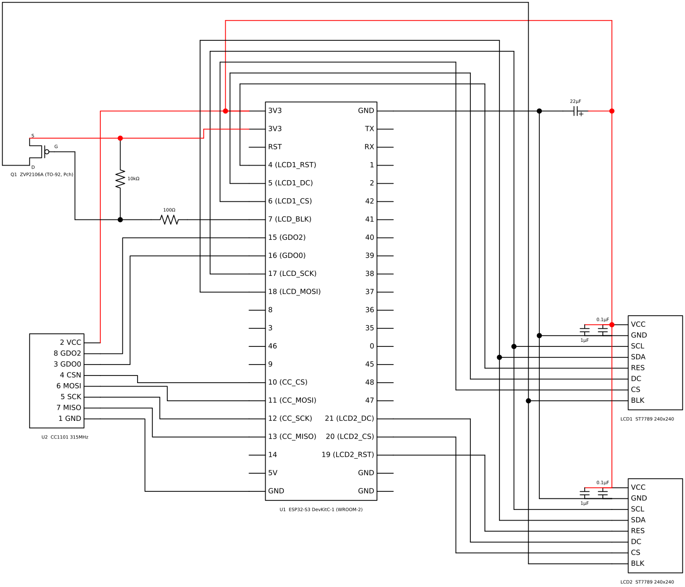

# TPMS受信機 ハードウェア構成（Nissan / Continental）

## 回路図（Schemdraw）



※ 回路図の生成スクリプト: `doc/image/generate_tpms_circuit.py`

## CC1101とESP32-S3-WROOM-2 N32R16V ピン対応表

### SPI接続

| CC1101 ピン番号 | CC1101 機能 | ESP32-S3 GPIO | 説明 |
|----------------|------------|---------------|------|
| 1 | GND | GND | グランド |
| 2 | VCC | 3.3V | 電源（3.3V） |
| 3 | GDO0 | GPIO16 | 汎用デジタル出力0（キャリア検出等に使用可能） |
| 4 | CSN | GPIO10 | SPI チップセレクト |
| 5 | SCK | GPIO12 | SPI クロック |
| 6 | MOSI (SI) | GPIO11 | SPI データ入力 (Master Out Slave In) |
| 7 | MISO (SO) | GPIO13 | SPI データ出力 (Master In Slave Out) |
| 8 | GDO2 | GPIO15 | 非同期データ出力（割り込み用）、GND線を平行に配置しAsync Data線のループ面積縮小＋擬似シールド |

### 備考

- **ESP32-S3-WROOM-2 N32R16V** はOctal Flash + Octal PSRAMを搭載
- **CC1101** は315MHz/433MHz/868MHz/915MHz帯のサブGHz無線トランシーバ
- **GDO0 (GPIO16)** : キャリアセンス出力（信号検出時Highでノイズ除去に使用）
- **GDO2 (GPIO15)** : CC1101から非同期データを受信し、エッジ検出割り込みで処理
- **電源** : CC1101は3.3V動作、ESP32-S3から直接供給可能

### ソフトウェア設定

```cpp
// SPI ピン定義 (src/main.cpp)
static const int PIN_CS   = 10;   // CC1101 pin4 CSN
static const int PIN_SCK  = 12;   // CC1101 pin5 SCK
static const int PIN_MOSI = 11;   // CC1101 pin6 MOSI
static const int PIN_MISO = 13;   // CC1101 pin7 MISO
static const int PIN_GDO0 = 16;   // CC1101 pin3 GDO0 (Carrier Sense)
static const int PIN_GDO2 = 15;   // CC1101 pin8 GDO2 (Async Data)
```

### 動作モード

このプロジェクトでは、CC1101を**非同期モード (Async Serial Mode)** で使用し、
GDO2ピンから出力される生データをESP32-S3で直接キャプチャして、
Manchester符号化されたContinental TPMSセンサーデータをデコードします。

#### 受信パラメータ

| 項目 | 設定値 |
|------|--------|
| 周波数 | 315.0 MHz |
| データレート | 8.192 kbps (half-bit ~122µs) |
| FSK偏差 | 40 kHz |
| 受信帯域幅 | 325 kHz |

#### GDO2によるバースト検出

GDO2のエッジ割り込みを常時稼働し、エッジ間隔が20ms以上のギャップを
検出したらバースト終了と判定する方式を採用。
バースト中のhalf-bit期間が100〜150µsの範囲のもののみ処理対象とし、
ノイズを除外します。

### フレーム構造（Continental / Nissan TPMS）

315.0 MHz / 8.192 kbps / FSK Manchester符号化（G.E. Thomas）

```
物理信号 (GDO2 raw edge stream)
──────────────────────────────────────────────────────────────────

[ プリアンブル                    ][ データ部 (8バイト = 64ビット)    ]
  F5 55 55 55 E (36 half-bits)     Brand + ID + Press + Temp + CRC

  Half-bit period: ~122µs (= 1/8192 bps)

──────────────────────────────────────────────────────────────────
Manchester符号化 (G.E. Thomas, half-bit単位)

  bit 0 → 01  (Low→High)
  bit 1 → 10  (High→Low)

──────────────────────────────────────────────────────────────────
パケット構造 (8バイト = 64ビット)

  +--------+--------+--------+--------+--------+--------+--------+--------+
  | Byte 0 | Byte 1 | Byte 2 | Byte 3 | Byte 4 | Byte 5 | Byte 6 | Byte 7 |
  +--------+--------+--------+--------+--------+--------+--------+--------+
  | Brand  | -------- Sensor ID (32bit) --------| Press  |  Temp  | CRC-8  |
  | (8bit) | MSB                            LSB | (8bit) | (8bit) | (8bit) |
  +--------+--------+--------+--------+--------+--------+--------+--------+

  Brand    : メーカーコード（0xA8 = Continental）
             bit5 でステータス判定（下記参照）
  SensorID : 32ビットセンサー固有ID
  Press    : 圧力 raw値 → PSI = raw / 4
  Temp     : 温度 raw値 → ℃ = raw − 52
  CRC-8    : poly=0x07, init=0xAA（Byte 0〜6 に対して計算）

──────────────────────────────────────────────────────────────────
Byte 8（CRC後の追加バイト、存在する場合）

  +----+----+----+----+----+----+----+----+
  | b7 | b6 | b5 | b4 | b3 | b2 | b1 | b0 |
  +----+----+----+----+----+----+----+----+
  |BAT | ?  |     6-bit Sequence Counter   |
  +----+----+----+----+----+----+----+----+

  bit 7    : バッテリーフラグ（0=正常, 1=低電圧 ※推定）
  bit 6    : 不明（既知センサーでは常に 1）
  bit 5-0  : シーケンスカウンタ（0〜63、送信ごとに変化）

  ※ 実測された既知センサーの extra 値は 0x40〜0x5F に集中
    (bit7=0, bit6=1, seq=0〜31)

──────────────────────────────────────────────────────────────────
Brand バイトのステータス情報

  Brand = 0xA8 (1010_1000) : Normal mode（安定圧力時）
  Brand = 0x98 (1001_1000) : Pressure Alert mode（圧力変動時）

  判定: bit 5 = 1 → Normal / bit 5 = 0 → Pressure Alert

  実測データ:
    brand=0xA8 (93回) : PSI 32.0〜50.2 の安定範囲のみ
    brand=0x98 (52回) : PSI 11.0〜63.0 の広範囲（空気注入中等）

  参考: Microchip AN00238C (SP37/Schrader系) では
    bit 1-0 が Operating State を示す:
      00=Initial/Storage, 01=Normal, 10=Pressure Alert, 11=Temp Alert
    Continental ではビット配置が異なるが機能は類似

──────────────────────────────────────────────────────────────────
デコード式

  PSI = pressureRaw / 4.0
  kPa = PSI × 6.895
  bar = kPa / 100
  ℃  = temperatureRaw − 52

──────────────────────────────────────────────────────────────────
センサーID一覧

  FL : AE5C32C8   FR : AC4ACC28
  RL : AE58E836   RR : AC4CCF67

──────────────────────────────────────────────────────────────────
参考

  BMW Gen5 Continental TPMS (rtl_433 Issue #2821) は同系統で
  88ビット（11バイト）のより長いフォーマットだが、
  本センサーは 64ビット（8バイト）の短縮版を使用。
  CRC多項式も異なる（BMW: poly=0x2F / Nissan: poly=0x07）。
```


---

## LCD ハードウェア構成

### 採用モジュール

| 項目 | 内容 |
|------|------|
| 型番 | 秋月電子 M154-240240-RGB |
| コントローラ | ST7789 |
| 解像度 | 240 × 240 px |
| 接続方式 | SPI（4線式, 書き込み専用）|
| 電源 | 3.3V |
| 購入日 | 2026-04-04 |

### ピン接続（ESP32-S3 ← → M154-240240-RGB）

CC1101 とは**独立した SPI3 バス**を使用（速度設定の切り替え不要、干渉なし）。

| M154 ピン | 機能 | ESP32-S3 GPIO | 備考 |
|-----------|------|---------------|------|
| VCC | 電源 | 3.3V | |
| GND | グランド | GND | |
| SCL | SPI クロック | GPIO17 | SPI3 専用（全LCD共有）|
| SDA | SPI MOSI | GPIO18 | SPI3 専用（全LCD共有）|
| RES | ハードリセット | GPIO4 | 第1LCD（左側、既存）|
| DC | データ/コマンド | GPIO5 | 第1LCD（左側、既存）|
| CS | チップセレクト | GPIO6 | 第1LCD（左側、既存）|
| BLK | バックライト | GPIO7 | 全LCD共用、Pch MOSFET(ZVP2106A) 高側スイッチで **LOW=ON**（PWM 調光可、起動時 OFF）|

右側用に追加する第2台LCDの制御ピン：

| 信号 | 第2LCD（右側） 推奨 GPIO | 備考 |
|------|------------------------|------|
| RES2 | GPIO19 | 第2LCD（右側）のハードリセット |
| DC2  | GPIO21 | 第2LCD（右側）の D/C |
| CS2  | GPIO20 | 第2LCD（右側）の CS |


### ソフトウェア設定

```cpp
#define LCD_SCK   17   // SPI3 専用
#define LCD_MOSI  18   // SPI3 専用
#define LCD_RST    4    // 第1LCD RST
#define LCD_DC     5    // 第1LCD DC
#define LCD_CS     6    // 第1LCD CS
#define LCD_BLK    7    // バックライト（全LCD共用）

// 追加LCD用（推奨）
#define LCD2_RST   19   // 第2LCD RST
#define LCD2_DC    21   // 第2LCD DC
#define LCD2_CS   20    // 第2LCD CS
```

### ライブラリ: Adafruit ST7789 Library, GFX Library

platformio.ini に追加：

```ini
lib_deps =
  adafruit/Adafruit ST7735 and ST7789 Library
  adafruit/Adafruit GFX Library
```

### 参考資料

- [CC1101 Datasheet](https://www.ti.com/lit/ds/symlink/cc1101.pdf)
- [ESP32-S3-DevKitC-1 User Guide](https://docs.espressif.com/projects/esp-dev-kits/en/latest/esp32s3/esp32-s3-devkitc-1/user_guide_v1.0.html)
- [RadioLib Documentation](https://github.com/jgromes/RadioLib)
- [Arduino TPMS Tyre Pressure Display](https://www.hackster.io/jsmsolns/arduino-tpms-tyre-pressure-display-b6e544)
- [reddit Need help decoding TPMS sensor](https://www.reddit.com/r/RTLSDR/comments/v0hqqf/need_help_decoding_tpms_sensor/)
- [Printables ESP32 with CC1101 Case](https://www.printables.com/model/1241571-esp32-with-cc1101-case)
- [rtl_433/BMW Gen5 TPMS support](https://github.com/merbanan/rtl_433/issues/2821)
