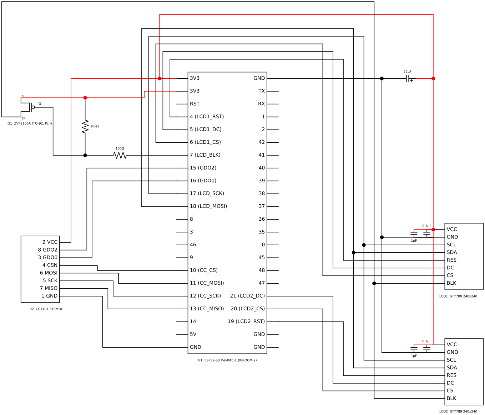

# TPMS受信機 ハードウェア構成（Nissan / Continental）

## 回路図（Schemdraw）



※ 回路図の生成スクリプト: `doc/image/generate_tpms_circuit.py`

## CC1101とESP32-S3-WROOM-2 N32R16V ピン対応表

### SPI接続

| CC1101 ピン番号 | CC1101 機能 | ESP32-S3 GPIO | 説明 |
|----------------|------------|---------------|------|
| 1 | GND | GND | グランド |
| 2 | VCC | 3.3V | 電源（3.3V） |
| 3 | GDO0 | GPIO16 | 汎用デジタル出力0（キャリア検出等に使用可能） |
| 4 | CSN | GPIO10 | SPI チップセレクト |
| 5 | SCK | GPIO12 | SPI クロック |
| 6 | MOSI (SI) | GPIO11 | SPI データ入力 (Master Out Slave In) |
| 7 | MISO (SO) | GPIO13 | SPI データ出力 (Master In Slave Out) |
| 8 | GDO2 | GPIO15 | 非同期データ出力（割り込み用）、GND線を平行に配置しAsync Data線のループ面積縮小＋擬似シールド |

### 備考

- **ESP32-S3-WROOM-2 N32R16V** はOctal Flash + Octal PSRAMを搭載
- **CC1101** は315MHz/433MHz/868MHz/915MHz帯のサブGHz無線トランシーバ
- **GDO0 (GPIO16)** : 初期化時にキャリアセンス出力（IOCFG0=0x0E）を設定するが、現行ソフトでは未使用（配線診断で読むのみ）。
  定期的な `radio.startReceive()` で RadioLib が IOCFG0 を書き換えるため、常時キャリアセンスとは限らない
- **GDO2 (GPIO15)** : CC1101から非同期データを受信し、エッジ検出割り込みで処理
- **電源** : CC1101は3.3V動作、ESP32-S3から直接供給可能

### ソフトウェア設定

```cpp
// SPI ピン定義 (src/main.cpp)
static const int PIN_CS   = 10;   // CC1101 pin4 CSN
static const int PIN_SCK  = 12;   // CC1101 pin5 SCK
static const int PIN_MOSI = 11;   // CC1101 pin6 MOSI
static const int PIN_MISO = 13;   // CC1101 pin7 MISO
static const int PIN_GDO0 = 16;   // CC1101 pin3 GDO0 (Carrier Sense)
static const int PIN_GDO2 = 15;   // CC1101 pin8 GDO2 (Async Data)
```

### 動作モード

このプロジェクトでは、CC1101を**非同期モード (Async Serial Mode)** で使用し、
GDO2ピンから出力される生データをESP32-S3で直接キャプチャして、
Manchester符号化されたContinental TPMSセンサーデータをデコードします。

#### 受信パラメータ

| 項目 | 設定値 | 備考 |
|------|--------|------|
| 周波数 | 315.022 MHz | 公称315.0MHz。実測 FREQEST が +22kHz 前後だったため同調点を補正 |
| データレート | 32.768 kbps | 受信機側の設定値（センサーの速度ではない）。非同期モードのため名目値で、ビット判定はESP32側で半ビット長（PARK 122µs / DRIVE 約52µs）により行う |
| FSK偏差 | 40 kHz | |
| 受信帯域幅 | 232 kHz | |
| IOCFG2 | 0x0D | GDO2 = 非同期データ出力 |
| PKTCTRL0 | 0x31 | 非同期シリアルモード |
| AGCCTRL2 / 1 / 0 | 0x43 / 0x50 / 0x92 | LNA最大ゲイン制限・キャリアセンス閾値・AGCフィルタ |
| FOCCFG | 0x3E | AFC 高速追従 |
| BSCFG | 0x10 | ビット同期ループ（非同期モードでは実質無関係） |

#### GDO2エッジ取得とパケット検出

1. **エッジ記録（ISR）**
   GDO2 の CHANGE 割り込みで、全エッジの時刻（`micros()`）とエッジ直後のレベルを
   リングバッファ（8192エッジ）へ止めずに記録する。
2. **窓切り出し（loop）**
   1024エッジずつ、前の窓と400エッジ重ねて切り出す（エッジが少ない時も30ms毎に解析）。
   重なりがあるので、窓の境界をまたいだパケットも必ずどこかの窓に丸ごと入る。
3. **パルス化・ヒゲ除去**
   エッジ列をパルス（幅＋レベル）列に変換し、0.35h 未満の短いパルスを前後に吸収する。
4. **ラン検出**
   「単独パルス幅 0.4h〜4.6h かつ 隣接2パルスの和が 1.6h〜6.6h」を満たすパルスが
   60個以上連続する区間をパケット候補（ラン）とする。
   - DRIVE: h=56µs（約45〜70µsをカバー）
   - PARK : h=122µs
   ノイズ（平均28µs程度）はこの条件を連続で満たせないため、ラン自体が立たない。
5. **ラン単位のデコード**
   - H/L 総時間の差からスライサの片寄り（bias）を推定して補正
   - 補正後の幅から実際の半ビット長（href）を実測
   - Manchester の位相2通り × 極性2通り × 全ビット位置で CRC を総当たり
   - 自車センサーID かつ CRC/範囲チェック合格のものだけ採用
6. **重複除去**
   窓の重なりで同じパケットを二度デコードした場合（同一ID・開始時刻差4ms未満）は捨てる。

その他の周期処理:

- RSSI / FREQEST を2ms毎にサンプリングし、デコード成功時に該当時間帯のピーク値をログ出力
- 500ms毎に VERSION レジスタでチップ生存確認、MARCSTATE が RX 以外なら RX に戻す
- 2秒毎に `radio.startReceive()` で RX を再スタート

### フレーム構造（Continental / Nissan TPMS）

センサーは状態によって **PARK（停止中）** と **DRIVE（走行中）** の2種類のフレームを送信する。
両者は半ビット長・フレーム長・CRC位置が異なるため、別フォーマットとして扱う。

#### PARK / DRIVE 比較

| 項目 | PARK（停止中） | DRIVE（走行中） |
|------|----------------|-----------------|
| 半ビット長 | 約122µs | 約52µs（実測 51.2〜52.4µs） |
| チップレート | 8192 chip/s | 約19.2 kchip/s |
| ビットレート | 4096 bps | 約9.6 kbps（9.5〜9.8 kbps） |
| プリアンブル | `F5 55 55 55 E`（36 half-bits） | bit0 × 15以上 ＋ 同期bit1 |
| フレーム長 | 8バイト（64ビット）＋任意の追加1バイト | 9バイト（72ビット） |
| Byte 7 | CRC-8 | Flags（繰り返し番号 01〜04） |
| Byte 8 | 追加バイト（BAT?/シーケンス） | CRC-8 |
| CRC対象 | Byte 0〜6 | Byte 0〜7 |
| Brand（実測） | 0xA8 / 0x98 / 0x80 | 0xB9 |
| 1回の送信 | 未整理 | 同一内容を4回（Flags=01→04） |

**速度表記の定義**（本書・コードはこの用語で統一）

- **半ビット長**: Manchester の半ビット（チップ）1個の幅。実測値でありすべての基準
- **チップレート [chip/s]** = 1 ÷ 半ビット長
- **ビットレート [bps]** = チップレート ÷ 2（Manchester は2チップで1データビット）
- CC1101 の「データレート 32.768 kbps」は受信機側の設定値で、センサーの速度ではない（非同期モードでは名目値）
- 外部情報の「16384bps」は実測と一致しないため使用しない

#### 共通事項

- 周波数: 315 MHz、FSK
- 符号化: Manchester（G.E. Thomas、half-bit単位）
  - bit 0 → `01`（Low→High）
  - bit 1 → `10`（High→Low）
- Sensor ID（Byte 1〜4）・Press（Byte 5）・Temp（Byte 6）の位置は両モード共通
- CRC-8: poly=0x07, init=0xAA（対象範囲のみモードで異なる）
- デコード式

  ```
  PSI = pressureRaw / 4.0
  kPa = PSI × 6.895
  bar = kPa / 100
  ℃  = temperatureRaw − 52
  ```

- センサーID一覧

  ```
  FL : AE5C32C8   FR : AC4ACC28
  RL : AE58E836   RR : AC4CCF67
  ```

#### PARK フレーム（停止中）

```
物理信号 (GDO2 raw edge stream)
──────────────────────────────────────────────────────────────────

[ プリアンブル                    ][ データ部 (8バイト = 64ビット)    ]
  F5 55 55 55 E (36 half-bits)     Brand + ID + Press + Temp + CRC

  Half-bit period: ~122µs (= 1/8192 chip/s)

──────────────────────────────────────────────────────────────────
パケット構造 (8バイト = 64ビット)

  +--------+--------+--------+--------+--------+--------+--------+--------+
  | Byte 0 | Byte 1 | Byte 2 | Byte 3 | Byte 4 | Byte 5 | Byte 6 | Byte 7 |
  +--------+--------+--------+--------+--------+--------+--------+--------+
  | Brand  | -------- Sensor ID (32bit) --------| Press  |  Temp  | CRC-8  |
  | (8bit) | MSB                            LSB | (8bit) | (8bit) | (8bit) |
  +--------+--------+--------+--------+--------+--------+--------+--------+

  Brand    : メーカーコード（0xA8 = Continental）
             bit5 でステータス判定（下記参照）
  SensorID : 32ビットセンサー固有ID
  Press    : 圧力 raw値 → PSI = raw / 4
  Temp     : 温度 raw値 → ℃ = raw − 52
  CRC-8    : poly=0x07, init=0xAA（Byte 0〜6 に対して計算）

──────────────────────────────────────────────────────────────────
Byte 8（CRC後の追加バイト、存在する場合）

  +----+----+----+----+----+----+----+----+
  | b7 | b6 | b5 | b4 | b3 | b2 | b1 | b0 |
  +----+----+----+----+----+----+----+----+
  |BAT?| ?  |     6-bit Sequence Counter   |
  +----+----+----+----+----+----+----+----+

  bit 7    : バッテリーフラグ？（0=正常, 1=低電圧 ※推定）
  bit 6    : 不明（既知センサーでは常に 1）
  bit 5-0  : シーケンスカウンタ（0〜63、送信ごとに変化）

  ※ 実測された既知センサーの extra 値は 0x40〜0x5F に集中
    (bit7=0, bit6=1, seq=0〜31)

──────────────────────────────────────────────────────────────────
Brand バイトのステータス情報

  Brand = 0xA8 (1010_1000) : Normal mode（安定圧力時）
  Brand = 0x98 (1001_1000) : Pressure Alert mode（圧力変動時）
  Brand = 0x80 (1000_0000) : 125kHz LF トリガー時

  判定: bit 5 = 1 → Normal / bit 5 = 0 → Pressure Alert

  実測データ:
    brand=0xA8 (93回) : PSI 32.0〜50.2 の安定範囲のみ
    brand=0x98 (52回) : PSI 11.0〜63.0 の広範囲（空気注入中等）

  参考: Microchip AN00238C (SP37/Schrader系) では
    bit 1-0 が Operating State を示す:
      00=Initial/Storage, 01=Normal, 10=Pressure Alert, 11=Temp Alert
    Continental ではビット配置が異なるが機能は類似
```

#### DRIVE フレーム（走行中）

```
物理信号 (GDO2 raw edge stream)
──────────────────────────────────────────────────────────────────

[ プリアンブル          ][同期][ データ部 (9バイト = 72ビット)              ]
  bit 0 × 15以上          bit 1  Brand + ID + Press + Temp + Flags + CRC
  (half-bit: 0101…01)     (10)

  Half-bit period: ~52µs（実測 51.2〜52.4µs、≒ 1/19200 chip/s）
  1フレーム長     : 約9〜10ms（約150パルス）

  ※ プリアンブルの bit0 個数は観測値（先頭が欠けている可能性あり）
  ※ 同期bit1 → Brand の境目で half-bit "0110" となり、
     プリアンブル直後に 2half-bit 幅(約104µs) のパルスが現れる

──────────────────────────────────────────────────────────────────
パケット構造 (9バイト = 72ビット)

  +--------+--------+--------+--------+--------+--------+--------+--------+--------+
  | Byte 0 | Byte 1 | Byte 2 | Byte 3 | Byte 4 | Byte 5 | Byte 6 | Byte 7 | Byte 8 |
  +--------+--------+--------+--------+--------+--------+--------+--------+--------+
  | Brand  | -------- Sensor ID (32bit) --------| Press  |  Temp  | Flags  | CRC-8  |
  | (8bit) | MSB                            LSB | (8bit) | (8bit) | (8bit) | (8bit) |
  +--------+--------+--------+--------+--------+--------+--------+--------+--------+

  Brand    : 0xB9 (1011_1001) を観測
             PARK の 0xA8 (1010_1000) と比べ bit4 / bit0 が 1。
             走行状態を示すビットと推定（未確定）
  SensorID : PARK と同じ
  Press    : PARK と同じ（PSI = raw / 4）※ 加圧状態での確認は未実施
  Temp     : PARK と同じ（℃ = raw − 52）
  Flags    : 1回の送信内の繰り返し番号。01 → 02 → 03 → 04 と変化
  CRC-8    : poly=0x07, init=0xAA（Byte 0〜7 に対して計算）
             ※ PARK と同じアルゴリズムだが対象が Flags まで含む

──────────────────────────────────────────────────────────────────
送信パターン

  1回の送信で同一データを4フレーム連続送信（Flags だけが 01〜04 で変化）
  フレーム間隔・送信周期は未計測

──────────────────────────────────────────────────────────────────
実測データ（2026-10-07, serial_20261007200329.log）

  条件: RL センサーを 700c ロードバイクリムに貼付けて回転
        大気圧（ゲージ圧 0）、室温

  B9 | AE 58 E8 36 | 01 | 4B | 01 | F7
  B9 | AE 58 E8 36 | 01 | 4B | 02 | FE
  B9 | AE 58 E8 36 | 01 | 4B | 03 | F9
  B9 | AE 58 E8 36 | 01 | 4B | 04 | EC
  Brand  ID=RL      P=0.25psi T=23℃ Flags  CRC

  RSSI -47〜-63 dBm、Manchester不正ペア率 0.00、2回の送信で8/8フレーム受信

──────────────────────────────────────────────────────────────────
過去の誤認（記録）

  ・外部情報の「16384bps」から half-bit を 31µs（bpsとして換算）/ 61µs（chip/sとして換算）
    と想定していたが、実測は約52µs（約19.2k chip/s、約9.6 kbps）。31µs 想定ではノイズが大量に通過し、
    CRC総当たりで他車IDの偽ヒットを量産していた。
  ・PARK と同じ 8バイト形式（Byte 7 = CRC）で検証していたため、
    ID は一致するのに CRC NG となっていた。
    実際は Byte 7 = Flags、Byte 8 = CRC（Byte 0〜7 対象）。
```

#### 受信側の判別方法

- PARK / DRIVE はラン検出の半ビット長で振り分ける（詳細は「GDO2エッジ取得とパケット検出」参照）
- CRC は PARK形式（Byte 0〜6 → Byte 7）を先に試し、不一致なら DRIVE形式（Byte 0〜7 → Byte 8）を試す
- DRIVE形式で一致したフレームはログに `DRIVE9 flags=xx` と表示される

#### 参考

```
  BMW Gen5 Continental TPMS (rtl_433 Issue #2821) は同系統で
  88ビット（11バイト）のより長いフォーマットだが、
  本センサーは PARK 64ビット / DRIVE 72ビットの短縮版を使用。
  CRC多項式も異なる（BMW: poly=0x2F / Nissan: poly=0x07）。
```


---

## LCD ハードウェア構成

### 採用モジュール

| 項目 | 内容 |
|------|------|
| 型番 | 秋月電子 M154-240240-RGB |
| コントローラ | ST7789 |
| 解像度 | 240 × 240 px |
| 接続方式 | SPI（4線式, 書き込み専用）|
| 電源 | 3.3V |
| 購入日 | 2026-04-04 |

### ピン接続（ESP32-S3 ← → M154-240240-RGB）

CC1101 とは**独立した SPI3 バス**を使用（速度設定の切り替え不要、干渉なし）。

| M154 ピン | 機能 | ESP32-S3 GPIO | 備考 |
|-----------|------|---------------|------|
| VCC | 電源 | 3.3V | |
| GND | グランド | GND | |
| SCL | SPI クロック | GPIO17 | SPI3 専用（全LCD共有）|
| SDA | SPI MOSI | GPIO18 | SPI3 専用（全LCD共有）|
| RES | ハードリセット | GPIO4 | 第1LCD（左側、既存）|
| DC | データ/コマンド | GPIO5 | 第1LCD（左側、既存）|
| CS | チップセレクト | GPIO6 | 第1LCD（左側、既存）|
| BLK | バックライト | GPIO7 | 全LCD共用、Pch MOSFET(ZVP2106A) 高側スイッチで **LOW=ON**（PWM 調光可、起動時 OFF）|

右側用に追加する第2台LCDの制御ピン：

| 信号 | 第2LCD（右側） 推奨 GPIO | 備考 |
|------|------------------------|------|
| RES2 | GPIO19 | 第2LCD（右側）のハードリセット |
| DC2  | GPIO21 | 第2LCD（右側）の D/C |
| CS2  | GPIO20 | 第2LCD（右側）の CS |


### ソフトウェア設定

```cpp
#define LCD_SCK   17   // SPI3 専用
#define LCD_MOSI  18   // SPI3 専用
#define LCD_RST    4    // 第1LCD RST
#define LCD_DC     5    // 第1LCD DC
#define LCD_CS     6    // 第1LCD CS
#define LCD_BLK    7    // バックライト（全LCD共用）

// 追加LCD用（推奨）
#define LCD2_RST   19   // 第2LCD RST
#define LCD2_DC    21   // 第2LCD DC
#define LCD2_CS   20    // 第2LCD CS
```

### ライブラリ: Adafruit ST7789 Library, GFX Library

platformio.ini に追加：

```ini
lib_deps =
  adafruit/Adafruit ST7735 and ST7789 Library
  adafruit/Adafruit GFX Library
```

### 参考資料

- [CC1101 Datasheet](https://www.ti.com/lit/ds/symlink/cc1101.pdf)
- [ESP32-S3-DevKitC-1 User Guide](https://docs.espressif.com/projects/esp-dev-kits/en/latest/esp32s3/esp32-s3-devkitc-1/user_guide_v1.0.html)
- [RadioLib Documentation](https://github.com/jgromes/RadioLib)
- [Arduino TPMS Tyre Pressure Display](https://www.hackster.io/jsmsolns/arduino-tpms-tyre-pressure-display-b6e544)
- [reddit Need help decoding TPMS sensor](https://www.reddit.com/r/RTLSDR/comments/v0hqqf/need_help_decoding_tpms_sensor/)
- [Printables ESP32 with CC1101 Case](https://www.printables.com/model/1241571-esp32-with-cc1101-case)
- [rtl_433/BMW Gen5 TPMS support](https://github.com/merbanan/rtl_433/issues/2821)
